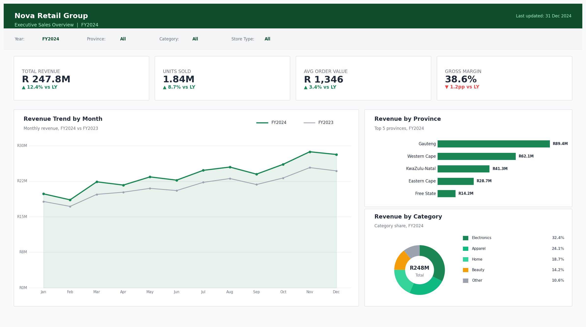
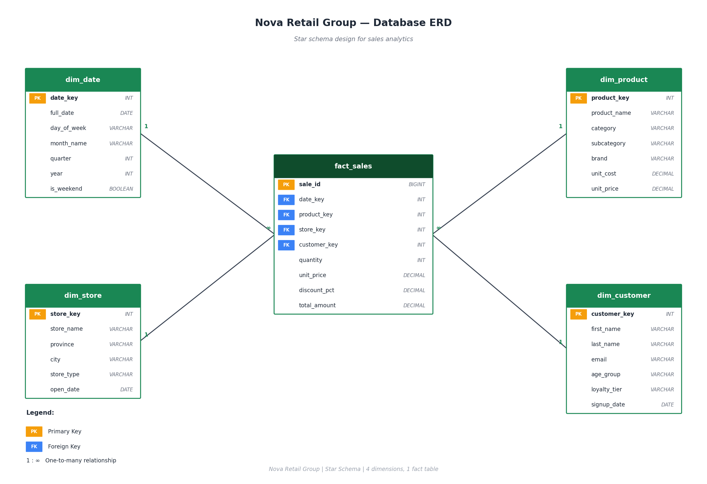
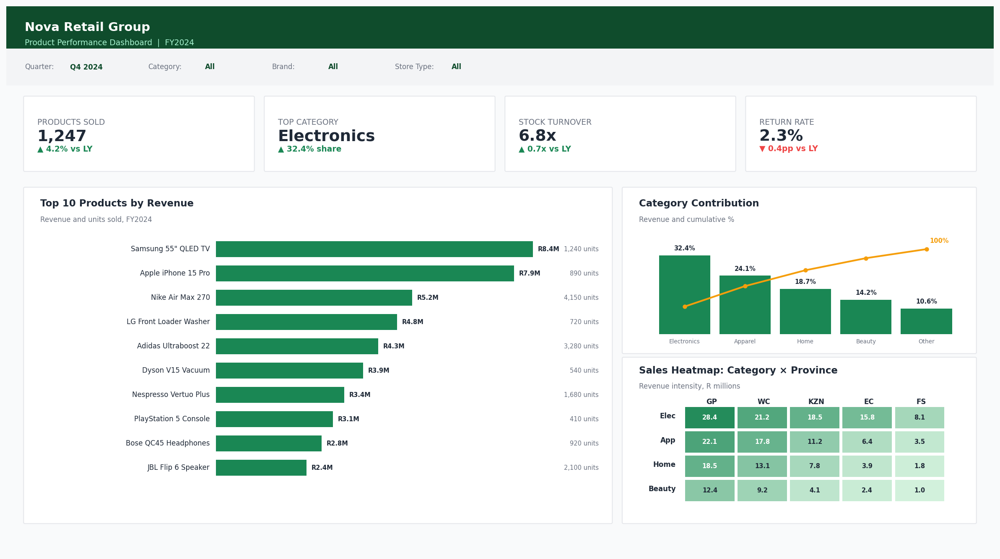

# Nova Retail Group — Sales Analytics

End-to-end retail analytics project: ERD design → SQL data warehouse → Power BI dashboards. Built for a fictional South African retail group to track revenue, product performance, and store operations across 10 stores in 5 provinces.



---

## 📌 Table of contents

- [The problem](#-the-problem)
- [What I built](#-what-i-built)
- [Tools & skills used](#-tools--skills-used)
- [The dataset](#-the-dataset)
- [Data quality issues](#-data-quality-issues)
- [How to run this project](#-how-to-run-this-project)
- [Project structure](#-project-structure)
- [Data model](#-data-model)
- [Dashboards](#-dashboards)
- [Key findings](#-key-findings)
- [What I learned](#-what-i-learned)
- [References](#-references)
- [About me](#-about-me)

---

## 🎯 The problem

Nova Retail Group is a fictional South African retail business with 10 stores across Gauteng, Western Cape, KwaZulu-Natal, Eastern Cape, and the Free State. The leadership team had three problems:

1. **No single source of truth.** Sales data lived in different systems — point-of-sale, customer loyalty, and finance — and no one trusted the numbers when they were combined.
2. **No view across stores.** Each store manager could see their own performance, but no one at HQ could compare a flagship store in Sandton to an express store in Bloemfontein.
3. **No product insight.** They knew which products sold a lot of units, but not which categories drove the most revenue or where category performance differed by region.

The leadership team wanted a clean data model, repeatable SQL, and a self-service Power BI dashboard that would let them answer the [15 business questions](docs/business-questions.md) we identified up front.

---

## 🛠️ What I built

A complete analytics pipeline from raw schema design to executive-ready dashboards:

1. **Designed a star schema** with one fact table and four dimensions, optimised for analytical queries and Power BI performance.
2. **Built the database in PostgreSQL** with idempotent SQL scripts for schema, seed data, and ~50,000 generated transactions across 3 years.
3. **Ran a full data quality audit** — orphan keys, duplicates, range violations, casing, completeness — documented every issue and the resolution decision.
4. **Wrote 10 analytical SQL queries** covering revenue, product mix, customer segmentation, geographic performance, and discount impact.
5. **Built two Power BI dashboards** — an Executive Overview and a Product Performance dashboard — driven by 20+ DAX measures.
6. **Documented everything** so a new analyst could pick up the project and run it end-to-end in under an hour.

---

## 💻 Tools & skills used

**Tools**
- PostgreSQL 15 (could be ported to SQL Server or MySQL with minor changes)
- Power BI Desktop
- DAX
- VS Code with the SQLTools extension
- Git and GitHub

**Skills**
- Dimensional modelling (star schema design)
- SQL — CTEs, window functions, ranking, time intelligence
- DAX — time intelligence, ranking, customer cohort logic
- Data validation and reconciliation
- Data quality auditing and remediation
- Dashboard design — KPI hierarchy, audience-led layout, colour discipline
- Technical writing and documentation

---

## 📦 The dataset

The full dataset lives in [`data/`](data/) as five CSV files. It's **fully synthetic** — no real customer or sales data is included — but it's been generated to look and behave like a real retail dataset, with the natural skew you'd expect (Gauteng over-indexed, December peaks, year-on-year growth, mixed payment methods).

| File                    | Rows    | Description                                          |
| ----------------------- | ------- | ---------------------------------------------------- |
| `dim_date.csv`          | 1,096   | Calendar: 2022-01-01 to 2024-12-31                   |
| `dim_product.csv`       | 20      | Products across Electronics, Apparel, Home, Beauty   |
| `dim_store.csv`         | 10      | Stores across 5 South African provinces              |
| `dim_customer.csv`      | 5,000   | Customers with loyalty tiers and demographics        |
| `fact_sales.csv`        | 50,000+ | Transactional sales at line-item grain               |

**Key dataset characteristics:**

- 3 years of history, weighted to show realistic year-on-year growth (2022 → 2024)
- Strong December seasonality and softer Jan/Feb periods
- Electronics is the dominant category by revenue; gift cards and accessories are a small tail
- Gauteng and Western Cape over-indexed for revenue (mirroring real South African retail patterns)
- Loyalty tier distribution skews Bronze (most customers) with a small Platinum elite

You can analyse the CSVs directly in Excel, Python, or any BI tool. The SQL scripts in [`sql/`](sql/) load these into a PostgreSQL database for the full Power BI workflow.

---

## ⚠️ Data quality issues

This dataset is intentionally messy in the same ways real retail data is messy. Part of this project's value is showing how to **find, document, and handle** these issues before they reach a dashboard.

| Issue                                           | Affected rows | Severity |
| ----------------------------------------------- | ------------- | -------- |
| Orphan `customer_key` in `fact_sales`           | ~12           | Medium   |
| Duplicate `sale_id` rows                        | ~8            | High     |
| Negative `quantity` (returns mixed into sales)  | ~25           | Medium   |
| `discount_pct` outside the 0-100 range          | ~5            | High     |
| Missing `email` in `dim_customer`               | ~250 (5%)     | Low      |
| Inconsistent casing in customer names           | ~150 (3%)     | Low      |
| Leading/trailing whitespace in customer names   | ~100 (2%)     | Low      |

Every issue is documented in [`docs/data-quality.md`](docs/data-quality.md) with:
- The SQL query to find it
- The decision on how to handle it (fix at source / fix in pipeline / flag and live with it)
- The downstream impact

The full set of automated data quality checks lives in [`sql/05_data_quality_checks.sql`](sql/05_data_quality_checks.sql) and runs before any analytical query.

---

## ⚙️ How to run this project

### Option 1 — Quick exploration (CSVs only)

If you just want to look at the data, the CSV files in `data/` open directly in Excel, Power BI, Python, or any SQL tool that supports CSV import. No database setup required.

### Option 2 — Full PostgreSQL workflow

**Prerequisites**
- [PostgreSQL 13+](https://www.postgresql.org/download/) installed locally or accessible
- [Power BI Desktop](https://powerbi.microsoft.com/desktop/) (Windows only, free)
- A SQL client (DBeaver, pgAdmin, or `psql` from the terminal)

**Step 1 — Set up the database**

```bash
# Create a new database
createdb nova_retail

# Connect to it
psql nova_retail
```

Then, from inside `psql`, run the SQL files in order:

```sql
\i sql/01_create_schema.sql        -- creates tables and indexes
\i sql/02_seed_data.sql             -- inserts a small sample dataset
\i sql/03_generate_data.sql         -- generates ~50,000 sales rows
\i sql/05_data_quality_checks.sql   -- run this BEFORE the analysis
\i sql/04_analysis_queries.sql      -- the 10 business queries
```

Alternatively, use `\COPY` to load the CSVs in `data/` directly into the tables created by `01_create_schema.sql`.

**Step 2 — Open the Power BI report**

1. Open `powerbi/nova_retail_dashboard.pbix` in Power BI Desktop.
2. When prompted, point the connection at your local `nova_retail` database.
3. Click **Refresh**.

> **Note on the .pbix file:** if you're viewing this on GitHub, the `.pbix` file is binary and won't render. Download it and open it in Power BI Desktop. The screenshots in this README show the dashboards as they appear when opened.

---

## 📁 Project structure

```
nova-retail-sales-analysis/
├── README.md                          ← You are here
├── LICENSE
├── .gitignore
│
├── data/
│   ├── dim_date.csv                   ← Calendar dimension (1,096 rows)
│   ├── dim_product.csv                ← Product dimension (20 rows)
│   ├── dim_store.csv                  ← Store dimension (10 rows)
│   ├── dim_customer.csv               ← Customer dimension (5,000 rows)
│   ├── fact_sales.csv                 ← Sales fact table (~50,000 rows)
│   └── README.md                      ← Notes on the synthetic dataset
│
├── sql/
│   ├── 01_create_schema.sql           ← Tables, keys, indexes
│   ├── 02_seed_data.sql               ← Small sample data
│   ├── 03_generate_data.sql           ← Generate 50k sales rows
│   ├── 04_analysis_queries.sql        ← The 10 business queries
│   └── 05_data_quality_checks.sql     ← Automated DQ checks
│
├── powerbi/
│   ├── nova_retail_dashboard.pbix     ← Power BI report file
│   ├── dax_measures.md                ← All DAX measures documented
│   └── README.md                      ← How to open the .pbix file
│
├── images/
│   ├── erd_diagram.png                ← Star schema diagram
│   ├── dashboard_executive.png        ← Executive dashboard screenshot
│   └── dashboard_product.png          ← Product dashboard screenshot
│
└── docs/
    ├── business-questions.md          ← The 15 questions this project answers
    ├── data-dictionary.md             ← Every table and column documented
    ├── data-quality.md                ← All DQ issues, decisions, and impact
    └── methodology.md                 ← How I built it, end to end
```

---

## 🗂️ Data model

The database uses a classic **star schema** with one fact table and four dimensions.



**Why star schema?**

- Fast analytical queries (small number of joins)
- Native fit for Power BI's relationship engine
- Easy for non-technical stakeholders to read

**Grain of fact_sales:** one row per product line item per sale. This grain supports basket analysis, product mix, and per-line discount tracking.

Full details in [`docs/data-dictionary.md`](docs/data-dictionary.md).

---

## 📊 Dashboards

### Executive Sales Overview

Built for the CFO and CEO. Top-line KPIs, monthly trend, and breakdowns by province and category.


**Designed to answer:**
- Are we growing year-on-year?
- Which provinces drive revenue, and which are underperforming?
- What does our category mix look like?

### Product Performance Dashboard

Built for buying and merchandising. Top products, category Pareto, and a category × province heatmap.



**Designed to answer:**
- Which products drive the most revenue, and what's their unit volume?
- Does the Pareto principle (80/20) apply to our category mix?
- Where are the geographic gaps and opportunities by category?

---

## 🔍 Key findings

A few headline insights from the analysis (full details in [`sql/04_analysis_queries.sql`](sql/04_analysis_queries.sql)):

1. **Revenue grew ~12% year-on-year** to roughly R 248M in FY2024, ahead of the R 240M target.
2. **Gauteng dominates with ~36% of total revenue** but Western Cape has the highest revenue-per-store, suggesting an under-stored Gauteng market.
3. **Top 3 categories drive ~75% of revenue** (Electronics, Apparel, Home) — the Pareto principle clearly applies.
4. **Gross margin compressed by ~1.2 percentage points** — driven mostly by deeper discounting in the 11-20% band, which grew transactions but eroded margin.
5. **Platinum loyalty customers spend several times more per visit** than Bronze tier — strongest case for investing in loyalty upgrades.

---

## 📚 What I learned

- **Star schemas earn their reputation.** Once the model was right, the SQL queries practically wrote themselves and Power BI performance was excellent out of the box.
- **The grain decision matters more than the column list.** Picking line-item grain over transaction grain doubled the row count but unlocked basket analysis, product mix, and discount tracking — none of which would have been possible at the higher grain.
- **Validate before you visualise.** I built a small set of DQ queries (orphan keys, duplicates, range checks) before touching Power BI. They caught data issues that would have been invisible in the dashboards.
- **Document the data quality decisions, not just the data quality issues.** The issues themselves are easy to find; the value is in the *decision* you made about each one.
- **Documentation is part of the deliverable, not an afterthought.** Writing the methodology document while building it kept my decisions honest — and makes the project portable to the next analyst.

Things I'd improve next time are listed in the closing section of [`docs/methodology.md`](docs/methodology.md).

---

## 📖 References

Resources and references used while building this project:

- Kimball, Ralph. *The Data Warehouse Toolkit, 3rd Edition*. Wiley, 2013. (Star schema design and dimensional modelling.)
- Microsoft Learn: [DAX function reference](https://learn.microsoft.com/dax/)
- Microsoft Learn: [Power BI guidance and best practices](https://learn.microsoft.com/power-bi/guidance/)
- PostgreSQL Documentation: [Window functions](https://www.postgresql.org/docs/current/tutorial-window.html)
- SQLBI articles by Marco Russo and Alberto Ferrari — particularly their patterns on time intelligence and ranking measures
- Storytelling with Data, Cole Nussbaumer Knaflic — for dashboard layout and colour discipline

The Nova Retail Group dataset is fictional. All customer, sales, and store data was synthetically generated for this project. No real personal data is included.

---

## 👤 About me

I'm a data analyst building portfolio projects in SQL, Power BI, and analytics engineering.

- 🌐 Portfolio: [yourwebsite.com](https://yourwebsite.com)
- 💼 LinkedIn: [linkedin.com/in/yourname](https://linkedin.com/in/yourname)
- 📺 YouTube: [Data with Clarence](https://youtube.com/@datawithclarence)
- 📧 Email: you@email.com

If you found this project useful, give it a ⭐ on GitHub.

---

*Built as part of the Witle Academy Data Analytics Programme.*
